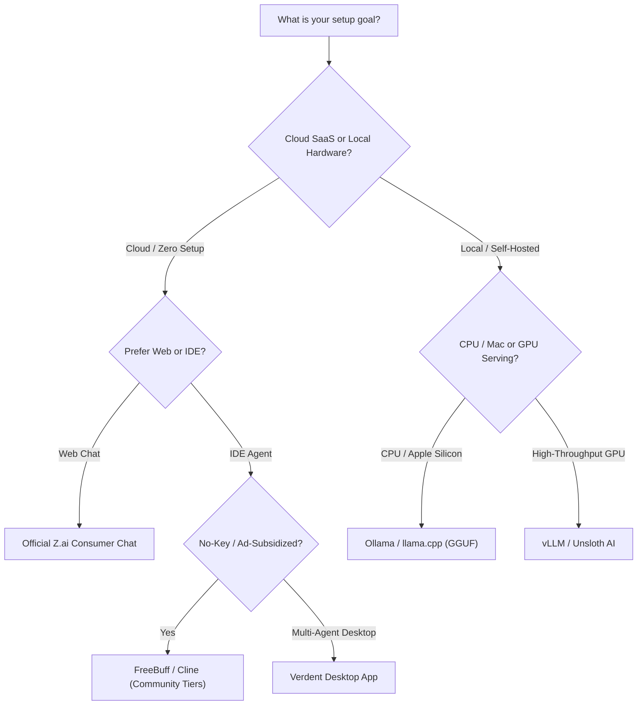

# ⚡ Awesome-GLM-Flash-Free

  

  

> 🚀 **A curated directory of 100% free, zero-cost, and developer-subsidized resources for GLM-5.3 & GLM-4 Flash models.** Access cutting-edge agentic coding assistants, free web chat interfaces, cloud API routers, and optimized open-source self-hosted runtimes without paying a penny.

---

## 📑 Table of Contents
- [🌟 Key Highlights](#-key-highlights)
- [☁️ Cloud Hosted / SaaS (No Setup Required)](#️-cloud-hosted--saas-no-setup-required)
- [💻 Self-Hosted / Open-Source (Requires Own Hardware)](#-self-hosted--open-source-requires-own-hardware)
- [🎯 Choosing the Right Tool](#-choosing-the-right-tool)
- [🤝 Contributing](#-contributing)
- [📈 Star History](#-star-history)

---

## 🌟 Key Highlights
- ⚡ **Zero-Credit Inferences:** Explore GLM Flash models with permanent free tiers or generous free developer trials.
- 🤖 **Agentic Coding:** Integrate GLM directly into IDEs like VS Code with Cline, Verdent, and FreeBuff.
- 🚀 **High-Throughput Local Inference:** Run optimized GGUF, AWQ, and 4-bit quantized weights via Ollama, vLLM, and Unsloth.

---

## ☁️ Cloud Hosted / SaaS (No Setup Required)

> **Market Overview (2026):** The global AI coding assistant & LLM developer tools market is estimated at **$9.3B–$11.0B in 2026** (growing at ~27% CAGR). The sector is currently **moderately to highly fragmented** rather than winner-take-all, with developers actively deploying a multi-tool stack combining native web chats, autonomous agents, and multi-model router gateways.

| Product / Service | Company Size (Valuation / ARR) | Description | Pricing (Starting Tier) | Free Tier / Trial Limits |
| :--- | :--- | :--- | :--- | :--- |
| **Official Z.ai Consumer Chat** | **~$62B–$71B Market Cap** ($1.6B ARR) | Access the model directly for free on the official Z.ai web browser chat platform. | Paid plans start at $18/mo (Lite GLM Coding Plan; yearly: $12.60/mo) | Free forever for web chat & Flash API (1 concurrent request limit, no credit card required) |
| **Cline VS Code Extension** | **$110M Valuation** ($32M Total Funding) | Available built natively into the Cline extension without requiring your own paid API key. | $0 for the extension (Open Source Apache 2.0; BYOK / model provider rates from $0.00/token) | Free forever extension with unlimited usage via local/Ollama models and free-tier provider integrations |
| **Verdent Desktop App** | **~$15M–$25M Est. Valuation** (Seed Funded) | Integrated as a zero-credit option inside the [Verdent](https://verdent.ai) multi-agent desktop application. | Starts at $19/mo (Starter plan with 320 credits/mo; top-ups from $20 for 340 credits) | 7-day free trial with 100 free credits upon signup |
| **AgentRouter / TokenRouter** | **~$5M–$10M Est. Valuation** (Early-Stage Gateway) | Accessible through developer routing abstractions using free developer promotional tiers. | Pay-per-token starting at base provider rates; TokenRouter plans from $10/mo | AgentRouter: $50 referral + $100–$200 GitHub bonus & $25/day check-in credits; TokenRouter: 1-day trial or 1,000 req/month free plan |
| **FreeBuff Coding Agent** | **<$1M Bootstrapped** (Indie / Ad-Supported) | Fully accessible at no cost on `freebuff.com` via developer-subsidised ads. | $0 / Free (100% ad-supported model, no subscription fees) | Free forever with unlimited prompts supported by in-CLI text ads (no credit card or API key required) |
| **YYLO CLI** | **<$1M Bootstrapped** (Open Source, MIT) | Free open-source terminal orchestrator that drives coding agents (Claude Code, Codex CLI, Gemini CLI) in parallel git worktrees with a typed task and merge lifecycle — BYOK: bring your own provider key, incl. the free Z.ai Flash tier via Claude-Code-compatible endpoints. | $0 (Open Source, MIT; BYOK — model rates from $0.00 on free provider tiers) | Free forever (MIT OSS); no credit card; unlimited orchestration with your own keys |

---

## 💻 Self-Hosted / Open-Source (Requires Own Hardware)

Deploy GLM Flash foundation models and weights directly on your personal workstation, Apple Silicon, or GPU clusters with these top-starred open-source engines:

* **Ollama**  🦙: Run GLM and open model weights locally with single-command setup and standard REST API endpoints.
* **Hugging Face Transformers**  🤗: Native model loading, tokenizer integration, and fine-tuning pipelines for GLM architectures via Hugging Face Hub.
* **vLLM Engine**  ⚡: High-throughput, low-latency LLM serving engine powered by PagedAttention with built-in GLM architecture support.
* **Unsloth AI Quantizations**  🦥: 2x–5x faster and 80% less memory fine-tuning with optimized GGUF & 4-bit quantizations for GLM Flash models.
* **llama.cpp**  🦙: Pure C/C++ local inference runtime on Apple Silicon, CPU, and CUDA for running quantized GLM GGUF checkpoints.
* **THUDM ChatGLM-6B**  🧠: Pioneer open-source bilingual conversational foundation model by Tsinghua KEG and Zhipu AI.
* **THUDM GLM-4**  🌐: Official open-source repository for the GLM-4 family, multimodal support, and Flash model weights.
* **THUDM ChatGLM3**  🛠️: Open conversational GLM model with built-in tool execution, Code Interpreter, and agent capabilities.

---

## 🎯 Choosing the Right Tool

---

## 🤝 Contributing
Contributions are always welcome! If you find any other zero-cost GLM resources, free API providers, or open tools:
1. 🍴 Fork this repository
2. 🌿 Create your feature branch (`git checkout -b feature/awesome-resource`)
3. 💾 Commit your changes (`git commit -m 'Add new free GLM resource'`)
4. 🚀 Push to the branch (`git push origin feature/awesome-resource`)
5. 📬 Open a Pull Request

---

## 📈 Star History

---

  Maintained with ❤️ by <a href="https://github.com/ishandutta2007">Ishan Dutta</a> and contributors.

